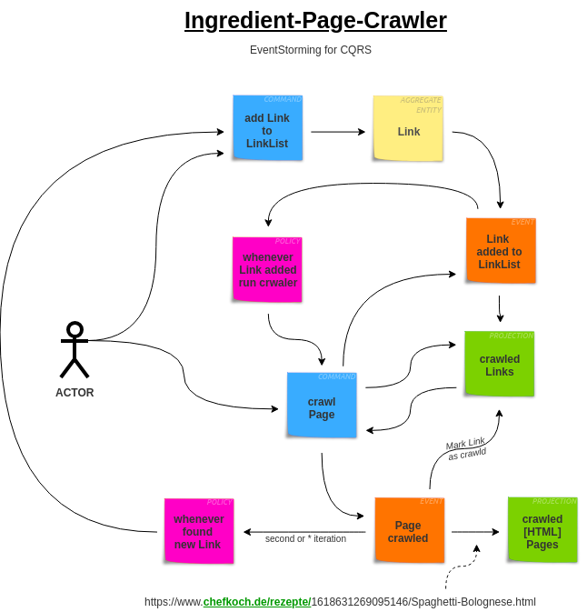

# Ingredient Page Crawler

[![Build Status][ico-travis]][link-travis]
[![Coverage Status][ico-scrutinizer]][link-scrutinizer]
[![Quality Score][ico-code-quality]][link-code-quality]




## Install Dependencies

Dependencies have to be installed with [composer](https://getcomposer.org/):

``` bash
$ composer install
```

## Install Dev Tooling

Developement tools have to be installed with [phive](https://phar.io/#Install):

``` bash
$ phive install
```

## Run the tests

Unit tests:

``` bash
$ ./tools/phpunit
```

Mutation tests:

``` bash
$ ./tools/infection
```

## Run static analyzer

Run the static code analyzer:

``` bash
$ PHAN_DISABLE_XDEBUG_WARN=1 PHAN_ALLOW_XDEBUG=0 ./tools/phan
```

## Run code style check

Run the [code style check](https://github.com/squizlabs/PHP_CodeSniffer):

``` bash
$ ./tools/phpcs src tests
```

[ico-travis]: https://img.shields.io/travis/social-food/ingredient-page-crawler/master.svg?style=flat-square
[ico-scrutinizer]: https://img.shields.io/scrutinizer/coverage/g/marcelheller-github/ingredient-page-crawler.svg?style=flat-square
[ico-code-quality]: https://img.shields.io/scrutinizer/g/marcelheller-github/ingredient-page-crawler.svg?style=flat-square

[link-travis]: https://travis-ci.org/social-food/ingredient-page-crawler
[link-scrutinizer]: https://scrutinizer-ci.com/g/marcelheller-github/ingredient-page-crawler/code-structure
[link-code-quality]: https://scrutinizer-ci.com/g/marcelheller-github/ingredient-page-crawler